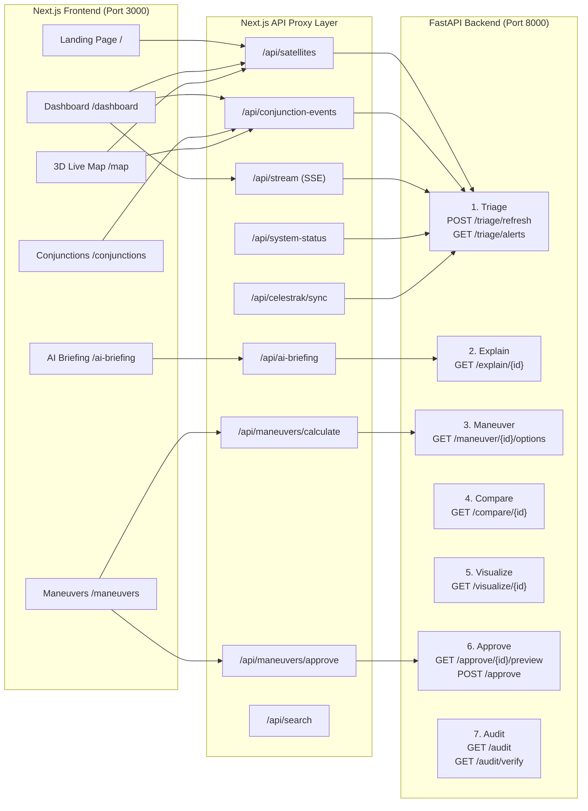

# OrbitGuard Frontend PRD — Complete Implementation Plan

> A single, comprehensive plan covering every page, every component, the 3D Earth View centerpiece, all 7 backend pillar integrations, the Origin Financial design system, and the full operator workflow from threat detection through cryptographic approval.

---

## Table of Contents

1. [System Overview & Architecture](#1-system-overview--architecture)
2. [Design System — Origin Financial Theme](#2-design-system--origin-financial-theme)
3. [Page 1 — Landing Page (`/`)](#3-page-1--landing-page-)
4. [Page 2 — Operations Dashboard (`/dashboard`)](#4-page-2--operations-dashboard-dashboard)
5. [Page 3 — Conjunction Screening Table (`/conjunctions`)](#5-page-3--conjunction-screening-table-conjunctions)
6. [Page 4 — Maneuver Planner & Sandbox (`/maneuvers`)](#6-page-4--maneuver-planner--sandbox-maneuvers)
7. [Page 5 — AI Situation Briefing (`/ai-briefing`)](#7-page-5--ai-situation-briefing-ai-briefing)
8. [Page 6 — 3D Live Map (`/map`)](#8-page-6--3d-live-map-map)
9. [Component — EarthView (Heart of the System)](#9-component--earthview-heart-of-the-system)
10. [Shared Components & Layout Shell](#10-shared-components--layout-shell)
11. [Backend ↔ Frontend API Contract](#11-backend--frontend-api-contract)
12. [Operator Workflow — End to End](#12-operator-workflow--end-to-end)
13. [File Change Summary](#13-file-change-summary)
14. [Verification Plan](#14-verification-plan)

---

## 1. System Overview & Architecture

OrbitGuard is an end-to-end satellite collision avoidance system. The frontend is a Next.js 15 application that serves as the operator console, consuming a FastAPI backend (`http://127.0.0.1:8000`) running the 7-pillar physics pipeline:



**Data Flow**: CelesTrak TLE → SGP4 Propagation → Conjunction Screening → Pc Computation → Risk Classification → Maneuver Solve → 3D Visualizer + Dashboard + AI Brief

---

## 3. Page 1 — Landing Page (`/`)

**File**: [page.tsx](file:///Users/abhimanraj/Desktop/ORBIT-GUARD/src/app/page.tsx) (existing, ~400 lines)

### Current State
- Static hero with a stars video backdrop, GSAP parallax mouse tracking
- 4 feature category cards (Iris Gleam, Cyan Signal, Periwinkle, Orchid Bloom)
- Glass navigation bar with backdrop blur
- Footer with links

### Changes Required

#### [MODIFY] Replace Video Backdrop with Live 3D Earth

The hero section currently uses a `<video>` element. Replace it with a **live `<EarthView />` component** rendered behind the hero text, making the 3D globe the visual centerpiece of the landing page.

- Import `EarthView` dynamically: `const EarthView = dynamic(() => import('@/components/EarthView'), { ssr: false })`
- Wrap in a full-viewport container with `pointer-events: none` on the text overlay, `pointer-events: auto` on the canvas
- Apply a subtle dark gradient overlay from bottom (`linear-gradient(to top, #0f1011 0%, transparent 40%)`) so hero text remains legible
- The globe auto-rotates slowly, showing real satellite dots (green/yellow/red) propagating in real time
- User can click-and-drag the Earth behind the text

#### No Changes Needed
- Feature cards, nav bar, and footer remain as-is — they already follow the Origin theme

---

## 4. Page 2 — Operations Dashboard (`/dashboard`)

**File**: [page.tsx](file:///Users/abhimanraj/Desktop/ORBIT-GUARD/src/app/dashboard/page.tsx) (existing, ~500 lines)

### Current State
- 4 stats cards (Total Satellites, Active Conjunctions, Critical Alerts, 72h Events)
- Fleet Status Telemetry list (left 60%)
- Active Hazard Conjunctions cards (right 40%)
- Satellite detail drawer (slide-in panel)

### Changes Required

#### [MODIFY] Embed Live 3D Earth in Dashboard

Restructure the dashboard layout to make the 3D Earth the centerpiece:

**New Layout (Split-Screen)**:
```
┌──────────────────────────────────────────────────────┐
│  Stats Bar (4 cards, full width)                     │
├────────────────────────┬─────────────────────────────┤
│  Threat Panel (40%)    │  3D Earth Visualizer (60%)  │
│  ┌──────────────────┐  │  ┌───────────────────────┐  │
│  │ Active Hazards   │  │  │                       │  │
│  │ sorted by Pc     │  │  │    EarthView globe    │  │
│  │                  │  │  │    with satellite      │  │
│  │ Click to focus → │  │  │    dots + orbit lines  │  │
│  │                  │  │  │                       │  │
│  │ Fleet Status     │  │  │    click interactions  │  │
│  │ below threats    │  │  │    zoom to threat      │  │
│  └──────────────────┘  │  └───────────────────────┘  │
└────────────────────────┴─────────────────────────────┘
```

- Import `EarthView` dynamically (same as landing page)
- Right panel: 60% width container with `min-height: 500px`, `border-radius: 16px`, `border: 1px solid rgba(255,255,255,0.1)`
- **TCA Focus Interaction**: Clicking any conjunction event in the left panel dispatches the selected satellite's coordinates to the EarthView component via a shared React context or prop callback
- The 3D globe camera will auto-rotate and zoom to the selected threat's TCA point
- Conjunction lines (dashed red/yellow) are drawn between the two objects at their predicted closest approach

#### Stats Cards
- Keep existing 4-card layout
- Style with Roboto Mono for numbers, Inter for labels
- Red pulse animation on Critical Alerts card when `count > 0`

#### Threat Panel (Left Side)
- Active Hazard Conjunctions listed by risk score (highest first)
- Each card shows: Event ID, Primary vs Secondary names, TCA countdown (Roboto Mono), miss distance, $P_c$ display
- Risk badge: RED = `bg-collision-red`, YELLOW = `bg-threat-amber`, GREEN = `bg-cleared-green`
- Click action: "Plan Maneuver →" button routes to `/maneuvers?event={id}`
- Click action: "View on Globe →" highlights the pair on the embedded EarthView

---

## 5. Page 3 — Conjunction Screening Table (`/conjunctions`)

**File**: [page.tsx](file:///Users/abhimanraj/Desktop/ORBIT-GUARD/src/app/conjunctions/page.tsx) (existing, 357 lines)

### Current State
- Summary stats header (total, active, critical, warning)
- Sortable/filterable table with columns: Primary, Secondary, TCA, Miss Distance, Pc, Risk Level
- Search bar, risk filter, status filter
- Click row → navigates to maneuver planner

### Changes Required

#### [MODIFY] Minor Styling Updates
- Already functional and connected to backend via `/api/conjunction-events`
- Ensure table header uses Roboto Mono uppercase labels with `tracking-wider`
- $P_c$ column should display in scientific notation using superscript formatting (already implemented as `pcDisplay`)
- Add a "Refresh Catalog" button in the header that calls `POST /api/celestrak/sync` to trigger a fresh CelesTrak TLE fetch and re-screen

#### [MODIFY] Add "Explain" Quick Action
- Add an info icon button on each row that opens a popover/modal calling `/api/ai-briefing` with the conjunction event ID
- Displays the Claude-generated 3–5 sentence plain-language explanation inline

---

## 6. Page 4 — Maneuver Planner & Sandbox (`/maneuvers`)

**File**: [page.tsx](file:///Users/abhimanraj/Desktop/ORBIT-GUARD/src/app/maneuvers/page.tsx) (existing, 1014 lines)

### Current State
- Event selector dropdown (loads active conjunction events)
- Calculates 3 burn options (MIN/BAL/MAX) via `/api/maneuvers/calculate`
- What-If Sandbox with Delta-V slider + burn direction selector
- AI briefing preview panel
- Telemetry console log
- Approve & transmit button

### Changes Required

#### [MODIFY] Connect Approval to Cryptographic Backend

The existing approval button currently sends to `/api/maneuvers/approve`. This route is already connected to the backend's gated approval flow (token preview → POST /approve). Verify the following behaviors:

1. **Safety Override Block**: When the backend returns a `409 Conflict` (disqualified burn due to secondary conjunction violations), the UI must display a prominent warning card:
   ```
   ⚠ MANEUVER BLOCKED — Secondary Conjunction Risk
   
   This burn creates a new conjunction closer than the original 
   threat separation. The system does not permit operator overrides 
   for disqualified orbits.
   
   Composite Score: 0.0/100
   ```
   Style: `bg-collision-red/10`, `border border-collision-red/30`, `text-collision-red`

2. **Role Selection**: Add an operator role dropdown (`Senior` / `Junior`) before the approve button. The backend enforces that Junior operators cannot approve burns consuming > 5.0 kg of fuel.

3. **Token Expiry Display**: Show the 10-minute countdown timer for the confirmation token. If the token expires, disable the approve button and show "Token Expired — Regenerate".

#### [MODIFY] Embed Inline 3D Visualization

When a conjunction event is selected:
- Load the backend's visualization data via `/api/visualize?candidate_id={id}`
- Show two orbit tracks in an inline mini-globe:
  - **Original trajectory**: dashed white line
  - **Post-maneuver trajectory**: solid Cyan Signal `#00b3dd` line
- The globe auto-focuses on the TCA point with a pulsing red sphere at closest approach

#### [MODIFY] Trade-off Comparison Panel

After calculating options, display the backend's ranked comparison from `GET /compare/{candidate_id}`:
- Show all 3 options ranked by composite score
- Highlight the recommended option with Iris Gleam border
- Display the reasoning text from the backend
- If `recommended_option_id` is `null` (all options disqualified), show the full disqualification reasoning

---

## 7. Page 5 — AI Situation Briefing (`/ai-briefing`)

**File**: [page.tsx](file:///Users/abhimanraj/Desktop/ORBIT-GUARD/src/app/ai-briefing/page.tsx) (existing, 251 lines)

### Current State
- Event selector from active conjunctions
- Generates briefing via `POST /api/ai-briefing`
- Displays briefing text with copy-to-clipboard
- Shows structured context data (JSON)

### Changes Required

#### [MODIFY] Style as Editorial Briefing Card

Restyle the briefing output to feel like an editorial document:
- **Briefing card**: Full-bleed Iris Gleam `#847dff` background with 30px border-radius
- **Briefing text**: Playfair Display 24px weight 400 italic, white text, generous 32px padding
- **Context data**: Roboto Mono 12px in a Graphite `#2e2e2e` panel below

#### [MODIFY] Connect to Backend Explanation Endpoint

The current flow calls `/api/ai-briefing` which hits `GET /explain/{candidate_id}` on the backend. Verify:
- The Claude-generated explanation text appears as the main briefing
- Structured context (miss distance, Pc, recommended Δv, fuel cost) is rendered in a data grid below
- A "Regenerate" button re-fetches the explanation

---

## 8. Page 6 — 3D Live Map (`/map`)

**File**: [page.tsx](file:///Users/abhimanraj/Desktop/ORBIT-GUARD/src/app/map/page.tsx) (existing, 13 lines)

### Current State
- Full-viewport container rendering `<EarthView />`
- Takes up `calc(100vh - 112px)` height

### Changes Required

#### [MODIFY] Full-Screen Immersive Mode

- Change height to `100vh` and add a z-index layer system
- Overlay a glassmorphic control panel (top-left) with:
  - Layer toggles: Satellites / Debris / Orbit Lines / Conjunction Lines
  - Time scrub slider (0–72h forward propagation)
  - Play/Pause animation control
  - Stats readout: total objects, active threats, system status
- Overlay a threat list (bottom-right) showing active conjunctions with click-to-focus
- Add keyboard shortcuts: `Space` = pause, `R` = reset camera, `L` = toggle layers

---

## 9. Component — EarthView (Heart of the System)

**File**: [EarthView.tsx](file:///Users/abhimanraj/Desktop/ORBIT-GUARD/src/components/EarthView.tsx) (existing, 1211 lines)

### Current State
This is a massive, fully-functional Three.js component that:
- Renders a textured Earth sphere with atmosphere glow
- Propagates satellite positions using SGP4 from real TLE data via `useOrbitStream()`
- Draws orbit lines for tracked objects
- Shows conjunction warning lines between threatening pairs
- Supports click-to-select satellites with a detail overlay
- Loads maneuver plans from `/api/maneuvers` and visualization data from `/api/visualize`
- Has layer toggles, time slider, animation pause/play

### Changes Required

#### [MODIFY] Accept External Selection Prop

Add an optional prop `selectedConjunctionId?: string` that, when set from a parent component (Dashboard or Conjunctions page), causes the camera to automatically zoom and rotate to focus on the selected conjunction's TCA geometry.

```typescript
interface EarthViewProps {
  selectedConjunctionId?: string;
  compact?: boolean;  // When true, hides the built-in overlay UI (for dashboard embedding)
}
```

- When `compact={true}`: Hide the built-in stats panel, layer toggles, and time slider (the parent page provides its own controls)
- When `compact={false}` (default): Show all built-in UI overlays (full map page mode)

#### [MODIFY] Post-Maneuver Trajectory Overlay

When visualization data is loaded for a selected conjunction:
- Render the **nominal trajectory** as a dashed white `THREE.Line` (dash pattern: 0.05 on, 0.05 off)
- Render the **post-maneuver trajectory** as a solid Cyan Signal `#00b3dd` `THREE.Line`
- Place a pulsing sphere at the TCA point with a label showing miss distance

---

## 10. Shared Components & Layout Shell

### [WorkspaceShell.tsx](file:///Users/abhimanraj/Desktop/ORBIT-GUARD/src/components/dashboard/WorkspaceShell.tsx)
- No changes needed. Already handles landing page vs dashboard layout switching.

### [Sidebar.tsx](file:///Users/abhimanraj/Desktop/ORBIT-GUARD/src/components/dashboard/Sidebar.tsx)
#### [MODIFY] Add Audit Trail Navigation
Add a new nav item for the Audit Trail page:
```typescript
{ name: "Audit Trail", href: "/audit", icon: Shield }
```

### [NEW] Page 7 — Audit Trail (`/audit`)
**File**: `src/app/audit/page.tsx`

A new page displaying the cryptographic audit log:
- Fetch all audit entries from `GET /api/audit` (proxied to backend `GET /audit`)
- Display as a chronological timeline with:
  - Timestamp (Roboto Mono)
  - Action type (approval_granted, etc.)
  - Operator name and role
  - Candidate ID and chosen option
  - Delta-V snapshot and fuel cost
- **Verify Chain** button: Calls `GET /api/audit/verify` and displays:
  - Green badge: "Hash Integrity Verified: 100% Intact" if `all_valid: true`
  - Red badge: "INTEGRITY VIOLATION DETECTED" with the broken entry highlighted

### [NEW] API Route — Audit (`/api/audit`)
**File**: `src/app/api/audit/route.ts`

Proxy to `GET http://127.0.0.1:8000/audit`

### [NEW] API Route — Audit Verify (`/api/audit/verify/route.ts`)

Proxy to `GET http://127.0.0.1:8000/audit/verify`

### [NEW] API Route — Visualize (`/api/visualize/route.ts`)

Proxy to `GET http://127.0.0.1:8000/visualize/{candidate_id}`

### [AlertBanner.tsx](file:///Users/abhimanraj/Desktop/ORBIT-GUARD/src/components/dashboard/AlertBanner.tsx)
- No changes needed. Already polls system status.

### [useOrbitStream.tsx](file:///Users/abhimanraj/Desktop/ORBIT-GUARD/src/lib/hooks/useOrbitStream.tsx)
- No changes needed. Already connected to `/api/satellites`, `/api/conjunction-events`, and `/api/stream`.

---

## 11. Backend ↔ Frontend API Contract

| Frontend Route | Method | Backend Endpoint | Purpose |
|---|---|---|---|
| `/api/satellites` | GET | `GET /triage/alerts` + TLE cache | Satellite positions with risk levels |
| `/api/conjunction-events` | GET | `GET /triage/alerts` | Active conjunction events |
| `/api/stream` | GET (SSE) | `GET /triage/alerts` (polled) | Real-time telemetry stream |
| `/api/maneuvers` | GET | `GET /audit` | Approved maneuver plans |
| `/api/maneuvers/calculate` | POST | `GET /maneuver/{id}/options` | Calculate 3 burn options (MIN/BAL/MAX) |
| `/api/maneuvers/approve` | POST | `GET /approve/{id}/preview` + `POST /approve` | Token-gated cryptographic approval |
| `/api/celestrak/sync` | POST | `POST /triage/refresh` | Re-fetch TLEs and re-screen |
| `/api/ai-briefing` | POST | `GET /explain/{id}` + `GET /triage/alerts` | AI situation briefing |
| `/api/system-status` | GET | `GET /triage/alerts` | System health status |
| `/api/search` | GET | `GET /triage/alerts` + TLE fallbacks | Search satellites and events |
| `/api/audit` | GET | `GET /audit` | **NEW** — Audit trail entries |
| `/api/audit/verify` | GET | `GET /audit/verify` | **NEW** — Hash chain verification |
| `/api/visualize` | GET | `GET /visualize/{id}` | **NEW** — Nominal vs maneuver ECEF tracks |

---

## 12. Operator Workflow — End to End

This is the complete user journey from opening the app to resolving a threat:

### Step 1: Awareness — Dashboard (`/dashboard`)
```
Operator opens dashboard → sees 4 stats cards → notices "2 Critical Alerts Active"
The embedded 3D Earth shows red pulsing dots on two satellite pairs.
The left panel lists active hazards sorted by Pc.
```

### Step 2: Investigation — Conjunctions (`/conjunctions`)
```
Operator clicks "View All Conjunctions" → full sortable table appears.
Sorts by Pc descending → top row shows:
  ISS (ZARYA) vs STARLINK-1556 | TCA: 4h 12m | Miss: 2.3 km | Pc: 8.25 × 10⁻²  [RED]
Clicks the "Explain" icon → AI briefing popover shows:
  "At 14:32 UTC, debris fragment STARLINK-1556 will pass within 2.3 km of ISS..."
Clicks the row → navigates to /maneuvers?event=CONJ-25544-46033
```

### Step 3: Analysis — Maneuver Planner (`/maneuvers`)
```
Event auto-selected → system calls POST /api/maneuvers/calculate
Three cards appear:
  ┌─────────────────┐  ┌─────────────────────┐  ┌─────────────────┐
  │ MINIMUM FUEL    │  │ ★ BALANCED          │  │ MAXIMUM SAFETY  │
  │ Δv: 6.5 m/s    │  │ Δv: 16.9 m/s        │  │ Δv: 38.8 m/s   │
  │ Fuel: 1.5 kg   │  │ Fuel: 3.9 kg         │  │ Fuel: 8.9 kg   │
  │ New miss: 7.6km │  │ New miss: 10.6km     │  │ New miss: 17.6km│
  │ Score: 41/100   │  │ Score: 53/100 ★ REC │  │ Score: 37/100   │
  └─────────────────┘  └─────────────────────┘  └─────────────────┘

Trade-off comparison panel shows:
  "Option 'medium burn' (mnv_46033_2) is recommended with a composite 
   score of 53.1/100..."

Inline 3D mini-globe shows:
  - Dashed white: original trajectory
  - Solid cyan: post-burn trajectory with TCA point marked

What-If Sandbox:
  Operator drags Δv slider → instant CW linear prediction updates
  Release → full SGP4 re-propagation via backend
```

### Step 4: Authorization — Approval Gate
```
Operator selects "Balanced" option → clicks "Approve & Transmit"
  1. Role selector: [Senior ▼] (Junior blocked if fuel > 5kg)
  2. System requests GET /approve/46033/preview?option_id=mnv_46033_2
  3. Token received — 10-minute countdown starts
  4. Operator confirms → POST /approve with token
  5. Backend validates: role, token, composite score > 0
  6. Success → SHA256 hash chain entry created in audit trail

If disqualified (score = 0.0):
  ⚠ RED BLOCK: "Maneuver creates secondary conjunction at 8.7 km,
  closer than original threat separation of 16.7 km. Blocked."
```

### Step 5: Verification — Audit Trail (`/audit`)
```
Operator navigates to /audit → chronological timeline of all decisions
  2026-08-20 16:01:35 | APPROVAL_GRANTED | Candidate 46033 | Balanced burn
    Δv: 16.975 m/s | Fuel: 3.919 kg | Approved by: Operator (Senior)

Clicks "Verify Chain Integrity" → GET /audit/verify
  ✓ Hash Chain Verified: 14/14 entries intact. No tampering detected.
```

### Step 6: Situational Awareness — 3D Map (`/map`)
```
Operator opens full-screen 3D map → Earth fills viewport
  - Green dots: safe satellites
  - Yellow dots: monitored conjunctions
  - Red pulsing dots: critical threats
  - Dashed lines: conjunction vectors at TCA
  - Solid cyan line: approved post-maneuver trajectory

Time slider → scrub forward 72 hours to see orbital evolution
Layer toggles → show/hide debris, orbit lines, conjunction lines
Click any satellite → side panel with full telemetry
```

---

## 13. File Change Summary

### Modified Files

| File | Change |
|------|--------|
| [`src/app/page.tsx`](file:///Users/abhimanraj/Desktop/ORBIT-GUARD/src/app/page.tsx) | Replace video backdrop with live 3D EarthView |
| [`src/app/dashboard/page.tsx`](file:///Users/abhimanraj/Desktop/ORBIT-GUARD/src/app/dashboard/page.tsx) | Split layout: 40% threat panel + 60% embedded EarthView |
| [`src/app/conjunctions/page.tsx`](file:///Users/abhimanraj/Desktop/ORBIT-GUARD/src/app/conjunctions/page.tsx) | Add "Explain" quick action + "Refresh Catalog" button |
| [`src/app/maneuvers/page.tsx`](file:///Users/abhimanraj/Desktop/ORBIT-GUARD/src/app/maneuvers/page.tsx) | Trade-off comparison panel, safety block UI, role selector, token timer, inline 3D viz |
| [`src/app/ai-briefing/page.tsx`](file:///Users/abhimanraj/Desktop/ORBIT-GUARD/src/app/ai-briefing/page.tsx) | Restyle as editorial briefing card with Iris Gleam background |
| [`src/app/map/page.tsx`](file:///Users/abhimanraj/Desktop/ORBIT-GUARD/src/app/map/page.tsx) | Full-screen immersive mode with glassmorphic overlays |
| [`src/components/EarthView.tsx`](file:///Users/abhimanraj/Desktop/ORBIT-GUARD/src/components/EarthView.tsx) | Add `selectedConjunctionId` and `compact` props, post-maneuver trajectory overlay |
| [`src/components/dashboard/Sidebar.tsx`](file:///Users/abhimanraj/Desktop/ORBIT-GUARD/src/components/dashboard/Sidebar.tsx) | Add "Audit Trail" nav item |

### New Files

| File | Purpose |
|------|---------|
| `src/app/audit/page.tsx` | Audit trail timeline with hash chain verification |
| `src/app/api/audit/route.ts` | Proxy → `GET /audit` |
| `src/app/api/audit/verify/route.ts` | Proxy → `GET /audit/verify` |
| `src/app/api/visualize/route.ts` | Proxy → `GET /visualize/{candidate_id}` |

---

## 14. Verification Plan

### Automated Tests
```bash
# Build verification — ensure no TypeScript compilation errors
cd /Users/abhimanraj/Desktop/ORBIT-GUARD && npm run build

# API integration verification
curl http://localhost:3000/api/satellites | jq length
curl http://localhost:3000/api/conjunction-events | jq length
curl http://localhost:3000/api/system-status | jq .status
curl http://localhost:3000/api/audit | jq length
curl http://localhost:3000/api/audit/verify | jq .all_valid
```

### Manual Verification Checklist

| Test | Expected Result |
|------|----------------|
| Landing page loads | 3D Earth renders in background, satellites visible, text legible |
| Dashboard loads | Split layout: threats left, 3D Earth right, stats top |
| Click conjunction in dashboard | 3D globe zooms to threat's TCA point |
| Conjunctions table sorts by Pc | RED events at top, correct scientific notation |
| Click "Explain" on conjunction row | AI briefing popover with Claude-generated text |
| Navigate to maneuvers with event | 3 burn options calculated, recommended highlighted |
| Approve a valid maneuver as Senior | Success response, plan status changes to "approved" |
| Attempt to approve disqualified burn | Red block displayed, approval prevented |
| Attempt to approve as Junior (fuel > 5kg) | Role restriction error displayed |
| AI Briefing page generates briefing | Iris Gleam card with Claude-generated text |
| Full-screen 3D map | Satellites propagate, orbit lines visible, layers toggle |
| Audit trail page | Timeline of all decisions, "Verify Chain" returns green |
| Time slider on map page | Orbital positions advance over 72-hour window |
