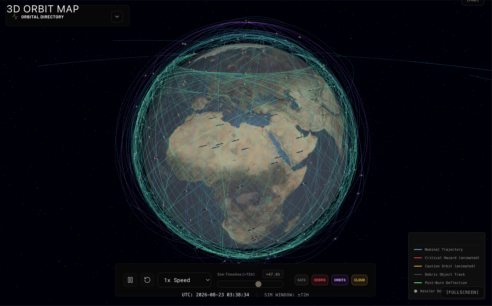

<p align="center">
  
</p>

<h1 align="center">🛡️ OrbitGuard</h1>

<p align="center">
  <strong>Real-Time Spacecraft Collision Avoidance & Space Situational Awareness Platform</strong>
</p>

<p align="center">
  
  
  
  
  
  
  
  
</p>

<p align="center">
  <em>A full-stack, mission-control-grade system that detects orbital conjunction threats, quantifies collision risk, solves physics-based evasive maneuvers, and renders everything in a photorealistic 3D WebGL environment — built to combat Kessler Syndrome.</em>
</p>

---

## 📑 Table of Contents

1. [Project Overview](#-project-overview)
2. [The Five System Pillars](#-the-five-system-pillars)
3. [Key Features](#-key-features)
4. [Tech Stack](#-tech-stack)
5. [System Architecture](#-system-architecture)
6. [Physics Engine & Mathematical Formulations](#-physics-engine--mathematical-formulations)
   - 6.1 [SGP4 Orbital Propagation & ECEF Rotation](#61-sgp4-orbital-propagation--ecef-rotation)
   - 6.2 [Akella-Alfriend 2D Collision Probability](#62-akella-alfriend-2d-collision-probability)
   - 6.3 [Clohessy-Wiltshire Maneuver Solver](#63-clohessy-wiltshire-relative-motion-maneuver-solver)
   - 6.4 [Tsiolkovsky Propellant Mass Calculation](#64-tsiolkovsky-propellant-mass-calculation)
   - 6.5 [Multi-Objective Trade-Off & Optimization](#65-multi-objective-trade-off-and-optimization)
7. [3D Orbit Visualizer](#-3d-orbit-visualizer)
8. [Scientific Validation Portal](#-scientific-validation-portal)
9. [Developer Audit Mode](#-developer-audit-mode)
10. [Pages & Routes](#-pages--routes)
11. [Constants & Formulas Reference](#-constants--formulas-reference)
12. [Getting Started](#-getting-started)
13. [Verification & Testing](#-verification--testing)

---

## 🌍 Project Overview

OrbitGuard exists to address **Kessler Syndrome** — the runaway chain reaction where collisions between orbiting objects produce debris that triggers further collisions, threatening to render Low Earth Orbit permanently unusable. Today there are over **36,000 tracked objects** in orbit and millions of fragments too small to track but large enough to destroy a spacecraft.

This platform gives operators the tools to **detect threats, understand risk, and act** before a collision occurs.

### The Closed-Loop Workflow

The system implements a **7-step closed-loop pipeline** that takes raw orbital data all the way through to a rendered, authorized maneuver:

```
┌──────────┐    ┌───────────┐    ┌──────────┐    ┌───────────┐    ┌────────────┐    ┌───────────┐    ┌───────────┐
│ 1. INGEST│───▶│2. PROPAGATE│───▶│3. DETECT │───▶│4. COMPUTE │───▶│ 5. SOLVE   │───▶│6. AUTHORIZE│───▶│ 7. RENDER │
│ Live TLE │    │   SGP4     │    │Conjunction│    │   Pc      │    │CW Maneuvers│    │   Burn    │    │   3D      │
│ from     │    │ Propagation│    │  Threats  │    │ (Akella-  │    │ + Rocket   │    │ (SHA-256  │    │ (Three.js │
│ CelesTrak│    │            │    │           │    │ Alfriend) │    │   Equation │    │  Token)   │    │  WebGL)   │
└──────────┘    └───────────┘    └──────────┘    └───────────┘    └────────────┘    └───────────┘    └───────────┘
```

| Step | Description |
|------|-------------|
| **1 — Ingest** | Live Two-Line Element (TLE) datasets are pulled from CelesTrak's GP catalog endpoint (configurable satellite groups: `active`, `stations`, `cubesat`, etc.) |
| **2 — Propagate** | Each TLE is fed through the SGP4/SDP4 propagator to compute position and velocity vectors in the TEME frame at arbitrary future times |
| **3 — Detect** | Conjunction screening runs a two-pass filter — orbital envelope pre-filtering followed by 60-second fine screening over a 48-hour window |
| **4 — Compute Pc** | The Akella-Alfriend 2D analytical collision probability model is evaluated on the encounter plane to quantify collision risk |
| **5 — Solve CW** | Three calibrated evasive maneuver options are generated using Clohessy-Wiltshire relative-motion targeting, each validated against nonlinear Kepler propagation |
| **6 — Authorize** | Operator reviews and authorizes the burn through a short-lived SHA-256 confirmation token with role-based access |
| **7 — Render 3D** | Nominal orbits, post-burn evasive trajectory, and danger zone sphere are rendered in a photorealistic WebGL globe with ECEF coordinate conversion |

To ensure mathematical precision, all calculations conform strictly to standard astrodynamics models.

### Constants Used

- $R_e$ = $6378.137\text{ km}$ (Earth equatorial radius)
- $GM$ = $398600.4418\text{ km}^3/\text{s}^2$ (Earth gravitational parameter $\mu$)
- $g_0$ = $9.80665\text{ m/s}^2$ (Standard gravity acceleration)

---

## 🏛️ The Five System Pillars

| Pillar | Name | Core Algorithm | Output |
|--------|------|----------------|--------|
| **1** | Conjunction Detection & Fine Screening | Three-stage progressive filtering (envelope → coarse 10min → fine 60s) | `ConjunctionCandidate` list with TCA and miss distance |
| **2** | AI Risk Triage & Explanation | Akella-Alfriend 2D Pc + Gemini/Groq AI briefing | Scored `Alert` objects with natural-language explanations |
| **3** | Evasive Maneuver Simulator | Clohessy-Wiltshire targeting + Tsiolkovsky fuel calc | Three `ManeuverOption` objects (small/medium/large burns) |
| **4** | Multi-Objective Trade-Off | Weighted composite scoring (40% safety, 30% fuel, 30% risk) | `RankedComparison` with recommended option |
| **5** | 3D Trajectory Visualization | Three.js WebGL + TEME→ECEF rotation + GMST | Photorealistic interactive 3D orbit renderer |

---

## ✨ Key Features

- 🔭 **Live Orbital Data** — Ingests TLE datasets from CelesTrak covering 16,000+ active satellites
- 🎯 **Three-Stage Conjunction Detection** — Envelope pre-filter → 10-min coarse screening → 60-second fine screening over 48 hours
- 📊 **Akella-Alfriend Collision Probability** — Operational-grade 2D analytical Pc computation used in real CDMs
- 🤖 **AI-Powered Risk Briefings** — Gemini/Groq-generated plain-language explanations of orbital threats
- 🚀 **CW Maneuver Solver** — Three pre-calibrated evasive burn options with independent nonlinear validation
- ⚖️ **Multi-Objective Optimization** — Automated trade-off scoring balancing safety, fuel cost, and secondary risk
- 🌐 **Photorealistic 3D Globe** — WebGL Earth with bump maps, specular oceans, 12,000-particle Kessler debris cloud
- 🔐 **SHA-256 Audit Trail** — Tamper-evident, cryptographically chained log of every system action
- 🛡️ **Secondary Conjunction Screening** — Post-burn trajectory screened against entire catalog to prevent new threats
- 📡 **Real-Time Updates** — Server-Sent Events (SSE) for live dashboard refresh

---

## 🛠️ Tech Stack

### Frontend

| Technology | Version | Role |
|---|---|---|
| **Next.js** (App Router) | 16.2 | Framework with Server Components, API Routes as backend proxy |
| **TypeScript** | 5 (Strict Mode) | Type-safe frontend and shared interfaces |
| **Three.js** | 0.184 | WebGL 3D Earth rendering, trajectory lines, particle systems |
| **satellite.js** | 4.1 | Client-side SGP4/SDP4 orbital propagation for the 3D map |
| **Recharts** | 3.8 | Propellant curves, lead-time efficiency, and displacement plots |
| **Radix UI** | Latest | Accessible Dialog, Dropdown, and Tab primitives |
| **GSAP** | 3.15 | Cinematic animations for the guided demo playbook |
| **Lucide React** | 1.17 | Icon system across the mission control UI |
| **pnpm** | ≥ 8.0 | Package manager |

### Backend

| Technology | Role |
|---|---|
| **Python 3.12** / **FastAPI** | Physics engine API server (SGP4, CW solver, Pc calculation, Kepler propagation) |
| **sgp4** (Python) | Server-side SGP4 propagation using `Satrec` objects from NORAD TLE data |
| **NumPy** | Matrix operations for CW state transition, covariance rotation, and coordinate transforms |
| **Supabase** | Persistent database for conjunction alerts, orbital parameters, and maneuver audit logs |
| **httpx** | Async HTTP client for CelesTrak data fetching and LLM API calls |
| **Gemini / Groq** | LLM providers for AI risk explanation generation (with template fallback) |

### Testing

| Technology | Role |
|---|---|
| **Vitest** | Physical correctness and integration contract test suite |

---

## 🏗️ System Architecture

```
┌───────────────────────────────────────────────────────────────────────────┐
│                              OrbitGuard v2.0                              │
│                                                                           │
│  ┌────────────┐  ┌──────────┐  ┌────────────┐  ┌───────────────────────┐ │
│  │  Dashboard  │  │  3D Map  │  │  Maneuvers │  │    AI Briefing        │ │
│  │ /dashboard  │  │  /map    │  │ /maneuvers │  │   /ai-briefing        │ │
│  └──────┬─────┘  └────┬─────┘  └─────┬──────┘  └──────────┬────────────┘ │
│         │              │               │                    │              │
│  ┌──────▼──────────────▼───────────────▼────────────────────▼───────────┐ │
│  │                     useOrbitStream (React Context)                    │ │
│  │      Reactive data bus: REST seed + SSE live updates (polling)       │ │
│  │      Exposes: satellites[], conjunctionEvents[], connectionStatus    │ │
│  └─────────────────────────────┬───────────────────────────────────────┘ │
│                                │                                          │
│  ┌─────────────────────────────▼───────────────────────────────────────┐ │
│  │                     Next.js API Routes (Proxy Layer)                 │ │
│  │  /api/satellites  /api/conjunction-events  /api/maneuvers/calculate  │ │
│  │  /api/visualize   /api/stream (SSE)        /api/triage/refresh      │ │
│  └─────────────────────────────┬───────────────────────────────────────┘ │
│                                │                                          │
│  ┌─────────────────────────────▼───────────────────────────────────────┐ │
│  │                        MockDatabase (db.ts)                          │ │
│  │   satellites[]  │  conjunctionEvents[]  │  maneuverPlans[]           │ │
│  └─────────────────────────────┬───────────────────────────────────────┘ │
│                                │                                          │
├────────────────────────────────┼──────────────────────────────────────────┤
│                                │                                          │
│  ┌─────────────────────────────▼───────────────────────────────────────┐ │
│  │                   FastAPI Physics Engine (:8000)                     │ │
│  │                                                                      │ │
│  │  ┌─────────────┐  ┌──────────────┐  ┌──────────────────────────┐   │ │
│  │  │   Routers    │  │   Services   │  │        Models            │   │ │
│  │  │ /triage      │  │ conjunction  │  │  Alert                   │   │ │
│  │  │ /explain     │  │ orbital_mech │  │  ManeuverOption          │   │ │
│  │  │ /maneuver    │  │ tradeoff     │  │  RankedComparison        │   │ │
│  │  │ /compare     │  │ explain      │  │  VisualizationData       │   │ │
│  │  │ /visualize   │  │ visualization│  │  ApprovalRecord          │   │ │
│  │  │ /approve     │  │ approval     │  │  AuditLogEntry           │   │ │
│  │  │ /audit       │  │ audit        │  │  TrajectoryPoint         │   │ │
│  │  └─────────────┘  │ risk_score   │  │  DangerZone              │   │ │
│  │                    │ data_fetch   │  └──────────────────────────┘   │ │
│  │                    │ lifecycle    │                                  │ │
│  │                    └──────────────┘                                  │ │
│  │                                                                      │ │
│  │  Physics: SGP4 │ CW Equations │ Akella-Alfriend Pc │ Tsiolkovsky   │ │
│  │           Universal Kepler │ TEME→ECEF │ Secondary Screening       │ │
│  └──────────────────────────────────────────────────────────────────────┘ │
│                                                                           │
│  ┌──────────────────────────────────────────────────────────────────────┐ │
│  │                       Supabase (Persistent Store)                    │ │
│  │   conjunction_alerts  │  maneuver_logs  │  audit_trail (SHA-256)    │ │
│  └──────────────────────────────────────────────────────────────────────┘ │
└───────────────────────────────────────────────────────────────────────────┘
```

**Key design decision:** The Next.js API Routes act as a **proxy layer** between the React frontend and the FastAPI physics engine. This serves two purposes: (1) it avoids CORS issues in production, and (2) it lets the frontend integration tests verify that the proxy faithfully passes through every field from the backend's Pydantic schemas without mutation — a critical property when the numbers being rendered represent physical quantities.

---

## 🔬 Physics Engine & Mathematical Formulations

### 6.1 SGP4 Orbital Propagation & ECEF Rotation

Each TLE is fed through the **SGP4/SDP4 propagator** to compute position and velocity vectors in the **TEME (True Equator, Mean Equinox)** inertial frame.

To align coordinates with a fixed Earth mesh in Three.js, ECI positions are rotated into the **Earth-Centered Earth-Fixed (ECEF)** rotating frame using Greenwich Mean Sidereal Time ($\theta_{\text{GMST}}$):

$$\vec{r}_{\text{ECEF}}(t) = \mathbf{R}_z(\theta_{\text{GMST}}(t)) \, \vec{r}_{\text{TEME}}(t)$$

$$\mathbf{R}_z(\theta) = \begin{pmatrix} \cos\theta & \sin\theta & 0 \\ -\sin\theta & \cos\theta & 0 \\ 0 & 0 & 1 \end{pmatrix}$$

The geodetic coordinates (longitude $\lambda$, latitude $\phi$, altitude $h$) are resolved relative to the WGS84 ellipsoid:

$$\lambda = \text{atan2}(y_{\text{ECEF}}, x_{\text{ECEF}})$$
$$\phi = \text{atan2}\left(z_{\text{ECEF}}, \sqrt{x_{\text{ECEF}}^2 + y_{\text{ECEF}}^2}\right)$$
$$h = |\vec{r}_{\text{ECEF}}| - R_e$$

**Implementation:** [`visualization.py`](backend/app/services/visualization.py)

---

### 6.2 Akella-Alfriend 2D Collision Probability

The collision probability follows the **Akella-Alfriend 2D analytical model**, which projects the 3D encounter geometry onto a 2D plane perpendicular to the relative velocity vector at TCA.

#### Encounter Frame Construction

$$\hat{e}_z = \frac{\Delta\vec{v}}{|\Delta\vec{v}|}, \qquad \hat{e}_x = \frac{\Delta\vec{r} \times \Delta\vec{v}}{|\Delta\vec{r} \times \Delta\vec{v}|}, \qquad \hat{e}_y = \hat{e}_z \times \hat{e}_x$$

#### RTN Covariance to ECI Rotation

Position uncertainty is expressed in the local **Radial-Transverse-Normal (RTN)** frame:
- **Primary asset:** $\sigma_R$ = 0.3 km, $\sigma_T$ = 1.5 km, $\sigma_N$ = 0.3 km
- **Secondary object:** $\sigma_R$ = 0.5 km, $\sigma_T$ = 2.0 km, $\sigma_N$ = 0.5 km

$$\mathbf{C}_{\text{ECI}} = \sigma_R^2 (\hat{u}_R \otimes \hat{u}_R) + \sigma_T^2 (\hat{u}_T \otimes \hat{u}_T) + \sigma_N^2 (\hat{u}_N \otimes \hat{u}_N)$$

Combined covariance: $\mathbf{C}_{\text{combined}} = \mathbf{C}_A + \mathbf{C}_B$

#### 2D Encounter Plane Projection

$$\mathbf{C}_e = \begin{pmatrix} \hat{e}_x \cdot \mathbf{C}_{\text{combined}} \cdot \hat{e}_x & \hat{e}_x \cdot \mathbf{C}_{\text{combined}} \cdot \hat{e}_y \\ \hat{e}_x \cdot \mathbf{C}_{\text{combined}} \cdot \hat{e}_y & \hat{e}_y \cdot \mathbf{C}_{\text{combined}} \cdot \hat{e}_y \end{pmatrix}$$

#### Final Pc Computation

$$P_c = \frac{R^2}{2\sqrt{\det(\mathbf{C}_e)}} \exp\left( -\frac{1}{2} \vec{r}_p^T \mathbf{C}_e^{-1} \vec{r}_p \right)$$

where $R$ = 15 m (combined hard-body radius) and $\vec{r}_p = [x_p, y_p]^T$ is the projected miss position.

**Implementation:** [`orbital-physics.ts`](src/lib/orbital-physics.ts)

---

### 6.3 Clohessy-Wiltshire Relative-Motion Maneuver Solver

Relative motion between two objects in nearby circular orbits is modeled using the **Clohessy-Wiltshire (Hill's) equations**:

$$x(\Delta t) = \frac{\Delta v_R}{n}\sin(n\Delta t) + \frac{2\Delta v_T}{n}\bigl(1 - \cos(n\Delta t)\bigr)$$

$$y(\Delta t) = \frac{2\Delta v_R}{n}\bigl(\cos(n\Delta t) - 1\bigr) + \frac{\Delta v_T}{n}\bigl(4\sin(n\Delta t) - 3n\Delta t\bigr)$$

$$z(\Delta t) = \frac{\Delta v_N}{n}\sin(n\Delta t)$$

The targeting formula uses **CW state transition matrix inversion**:

$$\vec{v}_{\text{burn}} = \Phi_{rv}^{-1} \left( \vec{r}_{\text{target}} - \Phi_{rr} \cdot \vec{r}_0 \right)$$

#### Three Pre-Calibrated Maneuver Options

| Option | Label | Target Separation Increase | Intent |
|---|---|---|---|
| 1 | `small burn` | +2.0 km | **Minimum Fuel** — smallest burn that materially changes geometry |
| 2 | `medium burn` | +5.0 km | **Balanced** — moderate fuel cost for a comfortable safety margin |
| 3 | `large burn` | +12.0 km | **Maximum Safety** — aggressive deflection for high-priority assets |

#### CW vs. Nonlinear Validation (`cw_divergence_flag`)

Every maneuver option is independently validated against **nonlinear two-body Kepler propagation** using a Universal Variable solver. If the CW prediction deviates by **>10%** from nonlinear propagation, `cw_divergence_flag = true` is set and a warning is displayed.

**Implementation:** [`orbital_mechanics.py`](backend/app/services/orbital_mechanics.py)

---

### 6.4 Tsiolkovsky Propellant Mass Calculation

$$m_{\text{prop}} = m_0 \left(1 - \exp\left(\frac{-\Delta V}{I_{\text{sp}} \cdot g_0}\right)\right)$$

| Parameter | Default | Notes |
|---|---|---|
| $m_0$ | 500 kg | Wet mass — configurable per spacecraft class |
| $I_{\text{sp}}$ | 220 s | Hydrazine monopropellant (typical: 200–300 s) |
| $g_0$ | 9.80665 m/s² | Standard gravitational acceleration |

**Implementation:** [`orbital_mechanics.py`](backend/app/services/orbital_mechanics.py)

---

### 6.5 Multi-Objective Trade-Off and Optimization

Each maneuver option is scored using a **weighted composite** of three normalized sub-scores:

$$\text{Score} = (0.40 \cdot S_{\text{safety}} + 0.30 \cdot S_{\text{fuel}} + 0.30 \cdot S_{\text{risk}}) \times 100$$

| Sub-Score | Weight | Formula |
|-----------|--------|---------|
| **Safety** | 40% | $S_{\text{safety}} = \min(1.0, d_{\text{achieved}} / 50.0)$ |
| **Fuel Efficiency** | 30% | $S_{\text{fuel}} = (f_{\text{max}} - f_{\text{cost}}) / (f_{\text{max}} - f_{\text{min}})$ |
| **Secondary Risk** | 30% | $S_{\text{risk}} = 1.0$ (no secondary conjunction) or $1.0 - d_{\text{original}} / d_{\text{secondary}}$ |

**Disqualification:** If a maneuver creates a secondary conjunction **closer** than the original threat, the option is hard-disqualified with a score of **0.0**.

**Implementation:** [`tradeoff.py`](backend/app/services/tradeoff.py)

---

## 🌐 3D Orbit Visualizer

<p align="center">
  
</p>

The 3D visualizer renders the full orbital picture in a **photorealistic WebGL environment** powered by Three.js:

| Component | Details |
|---|---|
| **Earth Mesh** | Phong material with elevation bump maps and specular ocean reflections |
| **Kessler Debris Cloud** | 12,000 particles across LEO (200–2,000 km), MEO (2,000–35,000 km), and GEO (35,786 km) |
| **Nominal Trajectories** | Protected asset and candidate object paths rendered as line geometries from ECEF samples |
| **Post-Burn Trajectory** | Evasive trajectory overlaid on nominal path — diverges after the computed burn time |
| **Danger Zone Sphere** | Transparent red sphere at the candidate's ECEF position at TCA |

#### ECEF-to-Three.js Coordinate Conversion

$$x_{\text{three}} = x_{\text{ECEF}} \times \text{SCALE}, \qquad y_{\text{three}} = z_{\text{ECEF}} \times \text{SCALE}, \qquad z_{\text{three}} = y_{\text{ECEF}} \times \text{SCALE}$$

$$\text{SCALE} = \frac{R_{\text{three}}}{R_{\text{wgs84}}} = \frac{6.371}{6378.137} \approx 9.989 \times 10^{-4}$$

**Implementation:** [`EarthView.tsx`](src/components/EarthView.tsx)

---

## 🔬 Scientific Validation Portal

The **Scientific Validation Portal** is an interactive Streamlit application designed for orbital analysts and space systems scientists. It provides empirical evidence that the SGP4 propagation algorithms, CW maneuver planning model, and frame rotation matrices are physically correct.

### How to Run

```bash
# Install dependencies
pip install -r requirements.txt

# Run the Streamlit application
streamlit run validation_portal.py
```

### Trajectory Reconstruction Validation

The portal uses **TLE-to-TLE cross-validation**: two distinct TLE updates for the same satellite (issued days apart) are propagated independently. If the mathematics is correct, the two trajectories converge in physical space within a tight tolerance (typically <5 km drift over 48 hours).

---

## 🔐 Developer Audit Mode

OrbitGuard implements a **tamper-evident audit trail** using SHA-256 hash chaining. Every system action (triage refresh, maneuver calculation, burn authorization) is recorded as an `AuditLogEntry` with:

- **SHA-256 chaining** — Each log entry's hash includes the previous entry's hash, creating an immutable chain
- **Role-based access** — Junior operators can preview maneuvers; only senior operators can authorize burns
- **Token-based authorization** — Short-lived SHA-256 confirmation tokens for burn approval
- **Timeline reconstruction** — Full lifecycle view of every conjunction event from detection to resolution

**Implementation:** [`audit.py`](backend/app/services/audit.py), [`approval.py`](backend/app/services/approval.py)

---

## 📄 Pages & Routes

### Frontend Pages

| Route | Description |
|---|---|
| `/` | Landing page with cinematic hero, guided demo playbook, and Web Speech API narration |
| `/dashboard` | Real-time threat registry cards, alert summaries, satellite status, conjunction count badges |
| `/map` | Photorealistic 3D WebGL Earth with SGP4-propagated orbits, Kessler debris cloud, interactive camera |
| `/maneuvers` | CW targeting solver, propellant curves, burn direction visualization, secure uplink authorization |
| `/conjunctions` | Historical and active conjunction event log with filtering, TCA countdown, miss distance telemetry |
| `/ai-briefing` | Natural-language safety briefings generated by Gemini/Groq with RTN covariance context |
| `/audit` | Tamper-evident SHA-256 chained audit trail of all system actions |

### API Routes (Next.js Proxy Layer)

| Route | Method | Backend Target |
|---|---|---|
| `/api/satellites` | GET | MockDatabase |
| `/api/conjunction-events` | GET | MockDatabase |
| `/api/maneuvers/calculate` | POST | FastAPI `/maneuver/{id}/options` + `/compare/{id}` |
| `/api/visualize` | GET | FastAPI `/visualize/{id}` |
| `/api/triage/refresh` | POST | FastAPI `/triage/refresh` |
| `/api/stream` | GET (SSE) | Server-Sent Events for real-time updates |

### FastAPI Backend Endpoints

| Route | Method | Description |
|---|---|---|
| `/triage/refresh` | POST | Run conjunction screening against satellite catalog |
| `/explain/{candidate_id}` | GET | Generate AI risk explanation |
| `/maneuver/{candidate_id}/options` | GET | Compute 3 CW maneuver options |
| `/compare/{candidate_id}` | GET | Rank options via trade-off optimization |
| `/visualize/{candidate_id}` | GET | Sample ECEF trajectories for 3D rendering |
| `/approve/{candidate_id}/preview` | GET | Preview maneuver with confirmation token |
| `/approve` | POST | Register authorized burn |
| `/audit/log` | GET | Retrieve SHA-256 chained audit trail |
| `/health` | GET | System health check |

---

## 📐 Constants & Formulas Reference

### Physical Constants

| Symbol | Value | Description |
|---|---|---|
| $R_e$ | 6378.137 km | WGS-84 Earth equatorial radius |
| $\mu$ (GM) | 398600.4418 km³/s² | Earth gravitational parameter |
| $g_0$ | 9.80665 m/s² | Standard gravitational acceleration |
| $\omega_{\text{Earth}}$ | 7.2921151467 × 10⁻⁵ rad/s | Earth rotation rate (WGS-84) |
| $R_{\text{combined}}$ | 15 m | Default combined hard-body radius for Pc |
| $m_0$ | 500 kg | Default spacecraft wet mass |
| $I_{\text{sp}}$ | 220 s | Default specific impulse (hydrazine monopropellant) |

### Key Formulas

| Formula | Expression | Context |
|---|---|---|
| **Semi-major axis** | $a = (\mu / n^2)^{1/3}$ | Kepler's Third Law from mean motion |
| **Orbital period** | $T = 2\pi\sqrt{a^3 / \mu}$ | LEO: ~92 min for ISS altitude |
| **Orbital velocity** | $v = \sqrt{\mu / r}$ | Circular orbit approximation |
| **Collision probability** | $P_c = \frac{R^2}{2\sqrt{\det(\mathbf{C}_e)}} \exp(-\frac{1}{2}\vec{r}_p^T \mathbf{C}_e^{-1} \vec{r}_p)$ | Akella-Alfriend 2D |
| **Tsiolkovsky equation** | $m_{\text{prop}} = m_0(1 - e^{-\Delta V / (I_{\text{sp}} \cdot g_0)})$ | Propellant mass |
| **ECEF rotation** | $\vec{r}_{\text{ECEF}} = \mathbf{R}_z(\text{GMST}) \cdot \vec{r}_{\text{TEME}}$ | Frame transformation |
| **Three.js scale** | $\text{SCALE} = 6.371 / 6378.137$ | km to scene units |

---

## 🚀 Getting Started

### Prerequisites

- **Node.js** ≥ 18.x
- **pnpm** ≥ 8.0
- **Python** ≥ 3.11
- **Supabase** account with a project

### Installation

```bash
# Clone the repository
git clone https://github.com/AbhimanRajCoder/ORBIT-GUARD.git
cd ORBIT-GUARD

# Install frontend dependencies
pnpm install

# Set up the backend
cd backend
python -m venv venv
source venv/bin/activate   # On Windows: venv\Scripts\activate
pip install -r requirements.txt

# Configure environment variables
cp .env.example .env
# Edit .env with your Supabase, Groq, and Gemini API keys
```

### Run the Development Servers

```bash
# Terminal 1 — Backend (FastAPI)
cd backend
source venv/bin/activate
uvicorn app.main:app --host 127.0.0.1 --port 8000 --reload

# Terminal 2 — Frontend (Next.js)
pnpm dev
```

Open [http://localhost:3000](http://localhost:3000) to launch OrbitGuard.

### Production Deployment (Docker)

```bash
# Build and run the backend
cd backend
docker build -t orbitguard-backend .
docker run -p 8000:8000 --env-file .env orbitguard-backend
```

---

## 🧪 Verification & Testing

### Run the Test Suite

```bash
# Run all tests
pnpm test

# Run with watch mode
pnpm test:watch
```

### Physical Correctness Tests

**File:** [`src/visualization_validation.test.ts`](src/visualization_validation.test.ts)

| Check | Validation | Pass Criteria |
|---|---|---|
| **1** | ECEF frame transformation against known ISS ground truth | ECEF coordinates within ±0.1 km; geodetic lat/lon within ±0.01° |
| **2** | WGS-84 scale consistency — `SCALE = 6.371 / 6378.137` | ISS at 420 km maps to correct Three.js distance |
| **3** | Earth rotation alignment across four offset candidates | Best offset error < 1.0° |
| **4** | SGP4 orbit trajectory closure over one full period | Closure distance < 0.05 Three.js units |
| **5** | Danger zone / TCA alignment with live visualization data | ECEF match within ±0.01 km |
| **6** | Multi-satellite ECEF trajectory consistency | All altitudes > 200 km |

### Integration Contract Tests

**File:** [`src/pillar_integration.test.ts`](src/pillar_integration.test.ts)

| Test | Validates |
|---|---|
| **Pillar 3/4** | `/api/maneuvers/calculate` matches FastAPI fields: `delta_v_ms`, `resulting_min_distance_km`, `fuel_cost_kg`, `cw_divergence_flag`, `composite_score`, `recommended_option_id` |
| **Pillar 5** | `/api/visualize` matches FastAPI fields: every `position_ecef_km` triplet, `danger_zone.center_ecef_km`, `frame === "ECEF"` |

### Backend Tests

| File | Coverage |
|---|---|
| `test_triage.py` | Conjunction screening, TLE ingestion, envelope filtering |
| `test_explain.py` | AI explanation generation with LLM provider fallback |
| `test_maneuver.py` | CW targeting, fuel calculation, secondary screening |
| `test_tradeoff.py` | Composite scoring, disqualification logic |
| `test_visualize.py` | ECEF trajectory sampling, GMST computation |
| `test_approve.py` | Approval flow, token validation, role-based access |
| `test_audit.py` | SHA-256 chained audit trail integrity |
| `validate_competition.py` | End-to-end validation across all pillars |

---

<p align="center">
  <strong>🛡️ Built to keep the orbits clear.</strong>
</p>
